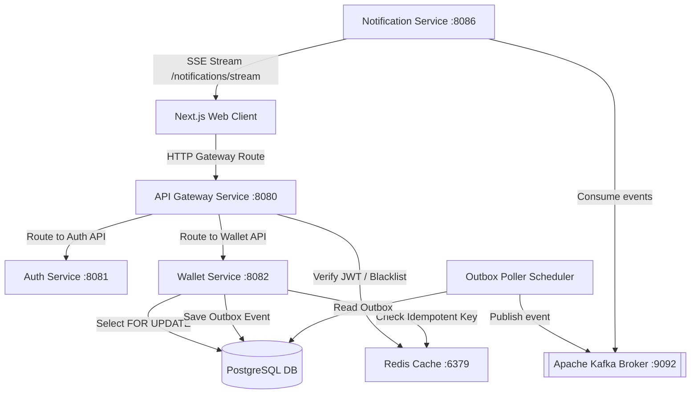
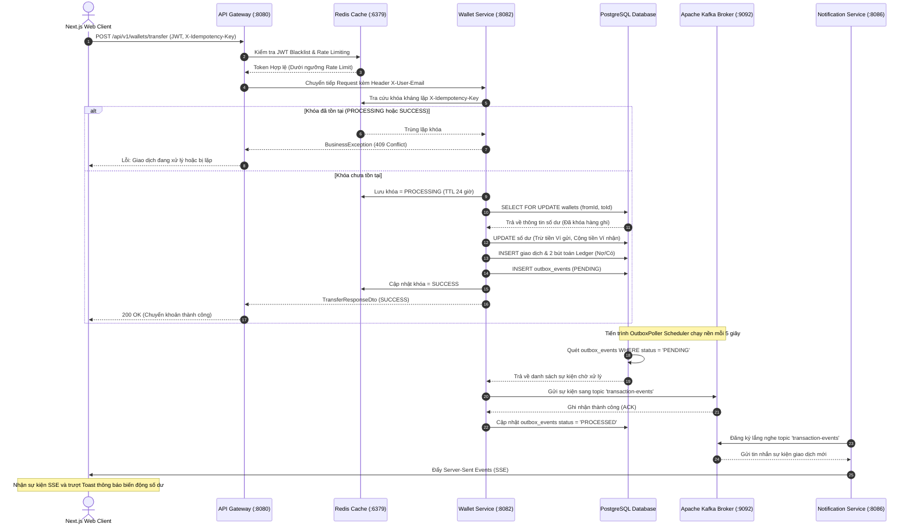

# Mini Digital Wallet - Fintech Core Core Dashboard (Monorepo)

Hệ thống Ví Điện Tử Mini (Mini Digital Wallet) là một ứng dụng Fintech Core mô phỏng hệ thống giao dịch tài chính thời gian thực hiệu năng cao. Dự án áp dụng các kiến trúc và kỹ thuật tiên tiến: **Clean Architecture**, **Sổ kế toán kép (Double-Entry Ledger)**, **Kiểm soát giao dịch đồng thời (Concurrency Control)**, **Bộ lọc kháng lặp giao dịch (Idempotency Engine)**, **Mô hình Transactional Outbox** kết hợp **Apache Kafka Pipeline** và **Server-Sent Events (SSE) Real-time Notifications**.

---

## 🏗️ Kiến Trúc Hệ Thống

Hệ thống được thiết kế theo mô hình Microservices hướng sự kiện (Event-Driven Microservices):



### 🔁 Luồng Đi Của API Chuyển Tiền (API Sequence Diagram)

Dưới đây là sơ đồ chi tiết biểu diễn luồng đi của dữ liệu từ khi Client gọi API chuyển khoản qua Gateway, đối soát kháng lặp Redis, ghi nhận sổ cái PostgreSQL, lưu Outbox và phát thông báo qua Kafka + SSE:



### 🖼️ Sơ đồ Luồng Hoạt Động (Operational Flow Diagram)

Dưới đây là hình ảnh trực quan hóa sơ đồ luồng hoạt động của hệ thống ví điện tử:


---

## 📂 Cấu Trúc Thư Mục Monorepo

- [`services/common-library`](file:///c:/Users/Admin/Desktop/duanFintechJava/services/common-library): Thư viện dùng chung của các microservices Java (chứa DTO Response, Exception Handler, JWT Utils, và `@Idempotent` Aspect).
- [`services/auth-service`](file:///c:/Users/Admin/Desktop/duanFintechJava/services/auth-service): Dịch vụ xác thực người dùng, cấp phát token JWT, lưu trữ blacklist token logout và OTP 2FA trên Redis.
- [`services/wallet-service`](file:///c:/Users/Admin/Desktop/duanFintechJava/services/wallet-service): Dịch vụ ví điện tử lõi. Xử lý logic chuyển khoản, ghi sổ kép PostgreSQL, lập trình AOP Aspect kháng lặp và Scheduler `OutboxPoller` quét gửi tin nhắn sang Kafka.
- [`services/gateway-service`](file:///c:/Users/Admin/Desktop/duanFintechJava/services/gateway-service): API Gateway dựa trên Spring Cloud Gateway thực hiện xác thực token, chặn token nằm trong blacklist Redis và Rate Limiter theo IP Client.
- [`services/notification-service`](file:///c:/Users/Admin/Desktop/duanFintechJava/services/notification-service): Dịch vụ thông báo tiêu thụ sự kiện từ Kafka và phát stream Server-Sent Events (SSE) về trình duyệt.
- [`frontend`](file:///c:/Users/Admin/Desktop/duanFintechJava/frontend): Ứng dụng Next.js 15+ Dashboard quản lý giao dịch, giám sát Kafka, Redis, Sức khỏe Actuator, Phát hiện gian lận và bộ máy giả lập (Simulators).

---

## 🚀 Hướng Dẫn Cài Đặt & Khởi Chạy Dự Án

### 📋 Yêu cầu tiên quyết
- **Java JDK 21** trở lên.
- **Node.js v20** trở lên.
- **Docker & Docker Compose** (để khởi chạy hạ tầng Postgres, Redis, Kafka).
- **Maven 3.9** trở lên (để compile Java).

---

### Bước 1: Khởi động Hạ tầng (Infras) bằng Docker Compose
Dự án cung cấp sẵn tệp cấu hình Infras cơ bản tại thư mục gốc. Chạy lệnh sau tại thư mục gốc dự án để khởi động cơ sở dữ liệu Postgres, Redis, Zookeeper và Kafka:

```bash
docker-compose up -d
```
*Sau khi khởi động:*
- Postgres chạy tại `localhost:5432` (Username/Password: `postgres`/`postgres`).
- Redis chạy tại `localhost:6379` (Không mật khẩu).
- Kafka Broker chạy tại `localhost:9092`.

*Lưu ý:* Bảng cơ sở dữ liệu `mini_wallet` sẽ được tự động tạo và cấu hình schema khi các dịch vụ Spring Boot khởi chạy thông qua **Flyway Migration Engine**.

---

### Bước 2: Biên dịch đóng gói Monorepo Backend
Chạy lệnh sau tại thư mục gốc dự án để compile và đóng gói mã nguồn Java:

```bash
mvn clean package -DskipTests
```
Lệnh này sẽ tự động biên dịch và tạo ra các tệp `.jar` trong thư mục `target/` của từng service con.

---

### Bước 3: Khởi chạy các Microservices Java (Backend)
Để hệ thống hoạt động hoàn hảo, bạn nên khởi chạy các dịch vụ theo thứ tự sau bằng IDE (như IntelliJ, VS Code) hoặc chạy dòng lệnh từ thư mục của từng dịch vụ:

1. **API Gateway Service** (Cổng `8080`):
   ```bash
   cd services/gateway-service
   mvn spring-boot:run
   ```
2. **Authentication Service** (Cổng `8081`):
   ```bash
   cd services/auth-service
   mvn spring-boot:run
   ```
3. **Wallet Core Service** (Cổng `8082`):
   ```bash
   cd services/wallet-service
   mvn spring-boot:run
   ```
4. **Notification Service** (Cổng `8086`):
   ```bash
   cd services/notification-service
   mvn spring-boot:run
   ```

---

### Bước 4: Cài đặt và Khởi chạy Frontend Next.js
Mở một terminal mới, điều hướng đến thư mục `frontend` để chạy giao diện Next.js:

```bash
cd frontend
npm install
npm run dev
```
Trình duyệt sẽ mở Dashboard tại địa chỉ: `http://localhost:3000`.

---

## 🐳 Khởi Chạy Bằng Docker Compose Toàn Bộ (Môi trường Sản xuất)

Nếu bạn muốn đóng gói và chạy toàn bộ hệ thống (bao gồm cả các dịch vụ Java và Next.js Frontend) dưới dạng container Docker độc lập có giới hạn RAM/CPU, chạy lệnh sau:

```bash
docker-compose -f docker-compose.prod.yml up --build -d
```
Lệnh này sẽ kích hoạt tính năng build Multi-stage Dockerfile cho từng service và khởi động tất cả dịch vụ tại cổng tương ứng.

---

## 🎯 Hướng Dẫn Thử Nghiệm & Giả Lập Trực Tiếp Trên UI

Để thực hiện kiểm tra các tính năng nâng cao, hãy truy cập trang Quản trị Admin tại `http://localhost:3000/admin`. Tại đây, giao diện cung cấp hộp **User Guidelines Box** hướng dẫn thao tác từng bước trực quan:

1. **Đóng băng Ví (Freeze/Unfreeze)**:
   - Vào Tab *Quản lý Ví*, bấm **Đóng băng** ví của `Bob` (ID: `3`).
   - Di chuyển sang trang `/transfer`, thử chuyển tiền vào ví ID `3`. Xác nhận hệ thống báo lỗi chặn giao dịch thành công.
2. **Race Condition Simulator (Tải Đa Luồng)**:
   - Vào Tab *Race Simulator*, cấu hình `50` hoặc `100` Threads đồng thời chuyển tiền từ ví `1` sang `2` với số tiền `1,000` VND.
   - Nhấp **Run Race**. Quan sát hệ thống xử lý tranh chấp qua khóa bi quan (Pessimistic lock), ngăn chặn rút quá hạn mức số dư và trả về thông báo đối soát số dư cuối cùng hoàn toàn khớp.
3. **Chaos & Recovery Simulator (Giả lập sập Kafka)**:
   - Vào Tab *Chaos & Recovery*, nhấp switch để chuyển trạng thái Kafka sang **OFFLINE**.
   - Sang trang `/transfer` thực hiện 3 giao dịch chuyển khoản.
   - Quay lại tab Chaos, quan sát **Hàng đợi Outbox (Outbox Queue)** tăng lên `3 Events PENDING` do Kafka Broker đang ngắt kết nối.
   - Nhấp **Recover Systems**, Kafka chuyển sang **ONLINE**, scheduler tự động quét và gửi bù 3 sự kiện Kafka thành công, hàng đợi outbox giảm dần về `0`.
